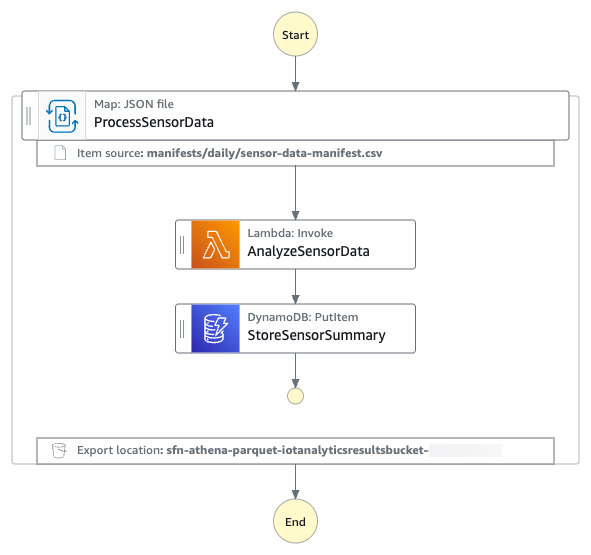

# Orchestrating big data processing with AWS Step Functions Distributed Map

This sample application demonstrates IoT sensor data analytics using AWS Step Functions Distributed Map with Athena manifest and Parquet file processing.

## Table of Contents

- [Workflow](#workflow)
- [Prerequisites](#prerequisites)
- [Quick Start](#quick-start)
- [Cleanup](#cleanup)
- [License](#license)

## Workflow

The following diagram shows the Step Functions workflow.



- AWS Step Functions: Orchestrates distributed processing using Distributed Map
- AWS Lambda Function: Processes individual sensor readings and detects anomalies
- Amazon Kinesis Data Firehose: Streams the processed records to an S3 bucket
- Amazon S3: Stores raw CSV data and analytics results

The system detects the following as anomalies:

- Temperature spikes (>35°C or <-10°C)
- Humidity anomalies (>95% or <5%)
- Low battery conditions (<20%)

## Prerequisites

- [Create an AWS account](https://portal.aws.amazon.com/gp/aws/developer/registration/index.html) if you do not already have one and log in.
- Have access to an AWS account through the AWS Management Console and the [AWS Command Line Interface (AWS CLI)](https://aws.amazon.com/cli). The [AWS Identity and Access Management (IAM)](https://aws.amazon.com/iam) user that you use must have permissions to make the necessary AWS service calls and manage AWS resources mentioned in this post. While providing permissions to the IAM user, follow the [principle of least-privilege](https://docs.aws.amazon.com/IAM/latest/UserGuide/best-practices.html#grant-least-privilege).
- [AWS CLI](https://docs.aws.amazon.com/cli/latest/userguide/install-cliv2.html) installed and configured
- [Git Installed](https://git-scm.com/book/en/v2/Getting-Started-Installing-Git)
- [AWS Serverless Application Model](https://docs.aws.amazon.com/serverless-application-model/latest/developerguide/serverless-sam-cli-install.html) (AWS SAM) installed
- Python 3.13+ installed

## Quick Start

### 1. Clone and navigate to stacks directory (all commands run from here)

Clone the GitHub repository in a new folder and navigate to project root folder:
```bash
git clone https://github.com/aws-samples/sample-stepfunctions-athena-manifest-parquet-file-processor.git
cd sample-stepfunctions-athena-manifest-parquet-file-processor
```

### 2. Install Python dependencies

Run the following command to install Python dependencies:

   ```bash
   python3 -m venv .venv
   source .venv/bin/activate
   python3 -m pip install -r requirements.txt
   ```

### 3. Build and deploy the application

Run the following commands to build and deploy the application

   ```bash
   sam build
   sam deploy --guided
   ```

Enter the following details:
- Stack name: The CloudFormation stack name(for example, sfn-parquet-file-processor)
- AWS Region: A supported AWS Region (for example, us-east-1)
- Keep rest of the components to default values.

The outputs from the `sam deploy` will be used in the subsequent steps. 

### 4. Generate the test data and upload it to Amazon S3 bucket
Run the following command to generate sample test data and upload it to the input S3 bucket. Replace `IoTDataBucketName` with the value from `sam deploy` output.

   ```bash
   python3 scripts/generate_sample_data.py <IoTDataBucketName>
   ```

### 5. Update the Amazon S3 location in Amazon Athena Workgoup
In the Amazon Athena console, navigate to workgroups, select the workgroup named "primary" and clickc on Edit.
In the Query result Configuration section, select as follows - 
   Management of query results - select Customer managed
   Location of query result - enter: ```s3://<IoTDataBucketName>```. Replace ```<IoTDataBucketName>``` with the value from `sam deploy` output.
Click on Save Changes to save the workgroup configuration
Note: You can create and select a workgroup of your choice and this workgroup needs to be updated in the AWS StepFunctions definition file in the Athen StartQueryExecution Task.

### 6. Create a database and tables in Amazon Athena

Run the following queries in Athena Query Editor. We will be creating two Athena tables - the "iotsensordata" table references to the raw data (in csv format) and the "iotsensordataanalytics" table references to the output from Kinsis data firehose that is stored in ```<IoTAnalyticsResultsBucket>``` S3 bucket.

Repalce ```<IoTDataBucketName>``` with the value from `sam deploy` output in the "iotsensordata" CREATE TABLE query. 
Replace ```<IoTAnalyticsResultsBucket>``` with the value from `sam deploy` output and ```<year>``` with current year (e.g 2025) in the "iotsensordataanalytics CREATE TABLE query.

``` bash
CREATE DATABASE `IOTSensorData`;

CREATE EXTERNAL TABLE IF NOT EXISTS `iotsensordata`.`iotsensordata` (
  `deviceid` string,
  `timestamp` string,
  `temperature` double,
  `humidity` double,
  `batterylevel` double,
  `latitude` double,
  `longitude` double
)
ROW FORMAT SERDE 'org.apache.hadoop.hive.serde2.lazy.LazySimpleSerDe'
WITH SERDEPROPERTIES ('field.delim' = ',')
STORED AS INPUTFORMAT 'org.apache.hadoop.mapred.TextInputFormat' OUTPUTFORMAT 'org.apache.hadoop.hive.ql.io.HiveIgnoreKeyTextOutputFormat'
LOCATION 's3://<IoTDataBucketName>/daily-data/'
TBLPROPERTIES (
  'classification' = 'csv',
  'skip.header.line.count' = '1'
);

CREATE EXTERNAL TABLE IF NOT EXISTS iotsensordata.iotsensordataanalytics ( deviceid string, analysisDate string, readingTimestamp string, readingsCount int, metrics struct< temperature: double, humidity: double, batterylevel: double, latitude: double, longitude: double >, anomalies array <string>, anomalyCount int, healthStatus string, timestamp string
)
ROW FORMAT SERDE 'org.openx.data.jsonserde.JsonSerDe'
WITH SERDEPROPERTIES ( 'ignore.malformed.json' = 'FALSE', 'dots.in.keys' = 'FALSE', 'case.insensitive' = 'TRUE'
)
STORED AS INPUTFORMAT 'org.apache.hadoop.mapred.TextInputFormat' OUTPUTFORMAT 'org.apache.hadoop.hive.ql.io.HiveIgnoreKeyTextOutputFormat'
LOCATION 's3://<IoTAnalyticsResultsBucket>/<year>/'
TBLPROPERTIES ('classification' = 'json', 'typeOfData'='file');
```

### 7. Test the AWS Step Functions workflow

Run the following command to start execution of the Step Functions. Replace the ```<StateMachineArn>``` and ```<IoTDataBucketName>``` with the value from `sam deploy` output.

```bash
aws stepfunctions start-execution \
  --state-machine-arn <StateMachineArn> \
  --input '{"IoTDataBucketName": "<IoTDataBucketName>"}'
```
The Step Functions statemachine has the Athena StartQueryExecution state which has an UNLOAD query that generates the sensor data files in a parquet format and also a manifest file in csv format. The manifest will have 5 rows referencing the 5 parquet files. Step Functions will process these 5 parquet files in one map run.

### 8. Monitor the state machine execution

Run the following command to get the details of the execution. Replace the `executionArn` from the previous command.

```bash
aws stepfunctions describe-execution --execution-arn <executionArn>
```

Wait until you get the status  `SUCCEEDED`.

### 9. Verify Results

Run the following Amazon Athena query - 
SELECT * FROM iotsensordata.iotsensordataanalytics WHERE anomalycount = 1;

The query result should have rows showing anomalies for sensor data that is beyond the threshold.

## Cleanup

Run the following commands to delete the resources deployed in this sample application.

1. **Delete S3 bucket contents:**

   ```bash
   aws s3 rm s3://<IoTDataBucketName> --recursive
   aws s3 rm s3://<IoTAnalyticsResultsBucketName> --recursive
   ```
2. **Drop Athena database and table**  
   ```
   DROP TABLE `iotsensordata`.`iotsensordata`;
   DROP TABLE `iotsensordata`.`iotsensordataanalytics`;
   DROP DATABASE `iotsensordata`;
   ```
3. **Delete the SAM stack:**

   ```bash
   sam delete
   ```

This project is licensed under the MIT-0 License. See the LICENSE file for details.
